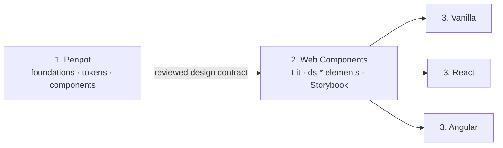

# Kanonis

A standalone, framework-independent design system shared across the Kanonis product family. Lit Web Components are the only component implementation; Vanilla JavaScript, React, and Angular consume those same custom elements. Kanonis packages use the `@endeavoury/kanosis*` package family, while the component contracts and semantic tokens remain product-neutral.


This repository is independent of both product applications. It has no application imports, API clients, authentication, financial business logic, or MDM domain logic.

## Why Kanonis?

Kanonis is the name we chose for our shared design system. It is inspired by the
Greek word _kanōn_, meaning a rule, standard, measure, or guiding principle. The
name reflects the system's purpose: defining the visual and interaction rules
shared across multiple products.

## Kanonis product family

| Brand         | Focus                             |
| ------------- | --------------------------------- |
| **Kanonis**   | Shared Design System              |
| **Ontarchon** | Master Data Management            |
| **Oikonomis** | Financial Insights                |
| **Nomopsis**  | Legal / legislation visualization |

## Architecture at a glance

The design system follows a three-layer architecture: Penpot defines the design language and component specifications, Lit Web Components provide the single framework-independent implementation, and thin integrations make those elements ergonomic in Vanilla JavaScript, React, and Angular.



Dependencies flow from design intent toward consumers. Framework integrations never reimplement visual behavior. See [Design system architecture](docs/architecture.md) for layer responsibilities, handoff workflow, runtime composition, and dependency rules.

## Quick start

```bash
npm install
npm run storybook
```

Storybook is the primary review environment. It contains foundations, every production component, reusable patterns, and representative Oikonomis screens using mock data.

Build and run the standalone Storybook with Docker Compose:

```bash
docker compose up --build
```

Open `http://localhost:6006`.

Set `DESIGN_SYSTEM_PORT` when port 6006 is already in use:

```bash
DESIGN_SYSTEM_PORT=6010 docker compose up --build
```

Run the complete quality gate with:

```bash
npm run check
```

Products without a JavaScript bundler can use the self-contained browser build:

```bash
npm run build:browser
```

This emits `packages/components/dist/browser/design-system.js` alongside the shared stylesheet in `packages/components/dist/styles.css`. It contains the same registered `ds-*` elements used by Angular and React consumers.

## Releases

Releases use semantic versioning and currently start at `1.0.0`. Every commit
pushed to `main` automatically creates the next patch release. Commits pushed
to `release/minor` or `release/major` create minor or major releases. A
successful run synchronizes all workspace versions, publishes all five npm
packages to GitHub Packages, publishes the Storybook container to GHCR, and
creates a GitHub Release with checksummed npm tarballs and a loadable Linux
AMD64 Docker archive.

```bash
docker pull ghcr.io/endeavoury/kanosis-storybook:1.0.1
```

See [Versioning and publishing](docs/publishing.md) for the one-time package
token setup, release procedure, image tags, and artifact verification.

## Product integrations

Ontarchon, Oikonomis, and Nomopsis consume this repository as a sibling checkout. Package history, releases, CI, and working trees remain fully independent while a shared parent directory lets local tools inspect all codebases. Ontarchon additionally passes this checkout as the named `design_system` Docker build context so its images remain reproducible without copying component source.

```text
Finance-Inzicht/
├── application/  → Endeavoury/Finance-Inzicht
└── design/       → Endeavoury/Kanosis

MDM/
└── projects/
    ├── studio/    → Angular consumer
    ├── nexus/     → Angular consumer
    └── website/   → Vanilla browser-bundle consumer
```

The application repository provides `scripts/setup-workspace.sh`, which clones
or updates this repository in the expected `design/` directory and prepares
both Node workspaces. Changes are committed and pushed directly from the
relevant sibling repository; there is no submodule pointer to update.

## Packages

| Package                       | Purpose                                                       |
| ----------------------------- | ------------------------------------------------------------- |
| `@endeavoury/kanosis-tokens`  | Semantic CSS tokens and typed token metadata                  |
| `@endeavoury/kanosis-styles`  | Opt-in global CSS and shared Lit style foundations            |
| `@endeavoury/kanosis`         | Web Component classes and registration entry points           |
| `@endeavoury/kanosis-react`   | Thin typed React adapters around the Web Components           |
| `@endeavoury/kanosis-angular` | Angular schema/registration helpers; no visual implementation |

Published packages are hosted by GitHub Packages. Consumers authenticate with
a token that has `read:packages`, then map the scope in their project or user
`.npmrc`:

```ini
@endeavoury:registry=https://npm.pkg.github.com
```

```bash
npm install @endeavoury/kanosis
```

## Usage

```ts
import '@endeavoury/kanosis';
import '@endeavoury/kanosis/styles.css';
```

```html
<ds-button variant="primary">Save</ds-button>
<ds-input label="Device name" name="deviceName"></ds-input>
<ds-status-badge tone="success">Online</ds-status-badge>
```

Register only a group when bundle size matters:

```ts
import '@endeavoury/kanosis/button';
import '@endeavoury/kanosis/forms';
```

The global stylesheet is intentionally opt-in. It installs tokens, theme defaults, typography, page colors, a small box-sizing normalization, and a few documented layout helpers. It does not restyle arbitrary buttons, inputs, headings, or links.

## Documentation

[Open the live Storybook documentation](https://endeavoury.github.io/Kanonis/) (published automatically from `main` with GitHub Pages).

- [Architecture](docs/architecture.md)
- [Current-product UI inventory](docs/ui-inventory.md)
- [Component roadmap and gap analysis](docs/component-roadmap.md)
- [External design-system review: Bootstrap, Material, Primer, and Atlassian](docs/external-design-system-review.md)
- [External review implementation report](docs/implementation-report.md)
- [Component capability matrix](docs/component-parity.md)
- [Component maturity and status](docs/component-maturity.md)
- [Component documentation template](docs/component-template.md)
- [Data table and data grid](docs/components/data-table.md)
- [Action, input, asset, and reordering additions](docs/components/maturity-additions.md)
- [Foundations, responsive ranges, and preferences](docs/foundations-and-preferences.md)
- [Saving and forms pattern](docs/patterns/saving-and-forms.md)
- [Messaging and feedback pattern](docs/patterns/messaging-and-feedback.md)
- [Adaptive layouts](docs/patterns/adaptive-layouts.md)
- [Responsive composition cookbook](docs/patterns/responsive-composition.md)
- [Accessible reordering and drag](docs/patterns/reordering-and-drag.md)
- [Brand themes and shared assets](docs/brand-and-assets.md)
- [Deprecation and migration policy](docs/deprecations.md)
- [Penpot token workflow](docs/penpot-token-workflow.md)
- [Design system review](docs/design-review.md)
- [Using components and framework adapters](docs/usage.md)
- [Theming and styling](docs/theming-and-styling.md)
- [Development and testing](docs/development.md)
- [Bundle architecture and measured sizes](docs/bundle-size.md)
- [Versioning and publishing](docs/publishing.md)

## Browser baseline

The package targets current evergreen browsers with Custom Elements, Shadow DOM, ElementInternals, CSS custom properties, and constructable stylesheet support. Consumers supporting older browsers must supply appropriate platform polyfills and validate form-associated behavior in their browser matrix.
