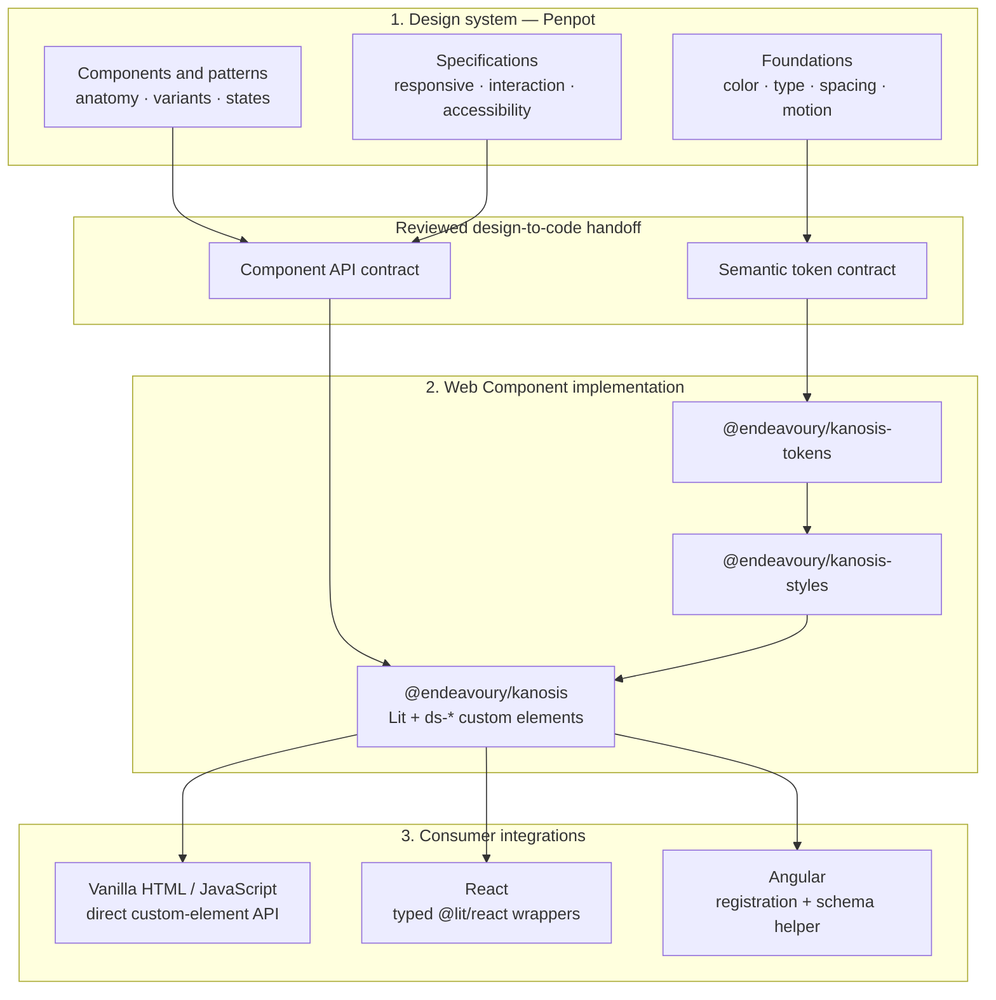
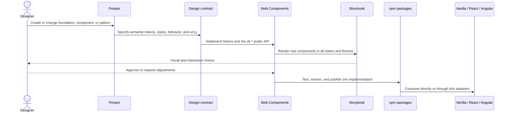
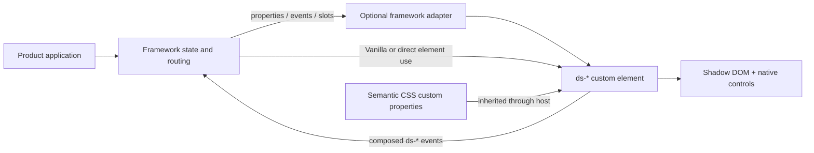

# Design System Architecture

## Decision summary

The architecture has three layers with a one-way dependency direction:

1. **Design system in Penpot** defines the visual language, semantic tokens, component anatomy, states, responsive behavior, and accessibility intent.
2. **Web Components** implement that contract once as standards-based `ds-*` custom elements. This is the only visual implementation.
3. **Framework integrations** expose the same elements to Vanilla JavaScript, React, and Angular without duplicating markup, behavior, or styling.

The design system is an independent npm workspace in its own `Kanosis` repository. It has no application imports and its build does not read application source. Finance-Inzicht and Ontarchon consume the same published packages in deployments and the same sibling workspace packages during local development; product screens are used only as inspiration for mock Storybook compositions.

The implementation uses **Lit 3 and standards-based custom elements**. Lit was selected because it keeps the shipped contract as Web Components while adding typed reactive properties, declarative templates, Shadow DOM, small runtime cost, and a maintained React adapter. React and Angular remain consumers; there are no framework-specific visual implementations.

## Layered architecture



Dependencies only point downward. Penpot does not contain runtime behavior, Web Components do not depend on a consuming framework, and integrations must not introduce their own visual implementation.

### Layer 1: Penpot design system

Penpot is the design and collaboration surface. It owns what a component should look like and how its variants, states, layout, and interaction are intended to work. The Penpot libraries should be organized into:

- **Foundations:** primitive palettes and scales for color, typography, spacing, radius, elevation, motion, breakpoints, icons, and density.
- **Semantic tokens:** purpose-based names such as `color.bg.surface` and `color.text.primary`, with light and dark theme values. These map to code variables such as `--ds-color-bg-surface` and `--ds-color-text-primary`.
- **Components:** reusable Penpot components with variants and states matching the public `ds-*` elements.
- **Patterns and screens:** compositions used to validate workflows and responsive behavior; these do not become a separate component implementation.
- **Specifications:** anatomy, content guidance, keyboard behavior, accessibility annotations, and responsive rules used during implementation and review.

Penpot and code are complementary sources of truth: Penpot owns design intent, while the versioned packages own executable behavior and public APIs. A design change is not released to consumers until its token or component contract is implemented, exercised in Storybook, and reviewed. Until an automated token pipeline is introduced, token changes are deliberately transcribed into the token package and reviewed in the same pull request as their component impact.

### Layer 2: Web Components

The Web Component layer turns the design contract into browser-native custom elements. Lit is an implementation aid; the public contract remains standard HTML elements, properties, attributes, slots, CSS custom properties, `::part()` hooks, and DOM events.

This layer owns:

- token assets and theme values;
- component markup, behavior, accessibility, and responsive styling;
- stable `ds-*` tags and `ds-*` custom events;
- grouped registration entrypoints and class-only imports;
- the Storybook reference implementation and component tests.

It does not own product data, routing, API calls, authentication, or framework-specific state management.

### Layer 3: Vanilla, React, and Angular integration

All consumers use the exact same registered custom elements:

- **Vanilla HTML/JavaScript** is the baseline integration. It imports a registration entrypoint, sets attributes or properties, and listens for DOM events.
- **React** uses optional typed `@lit/react` wrappers. The wrappers improve JSX property and custom-event ergonomics but render the same `ds-*` elements.
- **Angular** uses a registration helper plus `CUSTOM_ELEMENTS_SCHEMA`. Angular property and event bindings target the native element contract directly.

Framework adapters may translate framework conventions into the custom-element API. They may not fork styles, markup, validation, or interaction behavior. A missing capability is first added to the Web Component and then exposed through each adapter that needs additional typing or binding support.

## Design-to-release workflow



The handoff is a review loop, not a blind export. Generated values are useful input, but component behavior, naming, accessibility, and backwards compatibility still require implementation review.

## Runtime composition



At runtime, product applications own data and orchestration. Components receive values through attributes and properties, accept content through slots, and send user intent back through composed events. Semantic CSS custom properties carry themes across the Shadow DOM boundary.

## Current application stack

- Angular 22.1 standalone application, TypeScript 6, RxJS, Angular `HttpClient`.
- One root component currently owns navigation, authentication, dashboard analytics, forms, tables, and responsive behavior.
- Global CSS supplies all styling; there is no existing reusable component package or router-level component hierarchy.
- ASP.NET Core 10 API, PostgreSQL, background worker, and offline browser storage are application concerns and remain outside the design system.

## Workspace and package structure

```text
design-system/
├── packages/
│   ├── tokens/       semantic token CSS and typed token metadata
│   ├── styles/       global opt-in CSS and shared Lit style foundations
│   ├── components/   Web Components and registration entrypoints
│   ├── react/        thin @lit/react adapters
│   └── angular/      registration helper and Angular usage types/docs
├── storybook/        real component stories and product compositions
├── examples/         Vanilla, React, and Angular consumers
├── tests/            package, accessibility, and interoperability checks
└── docs/             architecture, audit, usage, contribution, publishing
```

Each workspace can build independently. Public packages use the `@endeavoury/kanosis*` family and one synchronized semantic version. Package identity does not affect the stable `ds-*` custom-element names.

Penpot remains outside the npm workspace because it is a design-authoring service rather than a runtime package. Links, exports, and handoff conventions can be recorded in repository documentation without coupling package builds to Penpot availability.

## Component and Shadow DOM strategy

- Every visual component is a custom element with a `ds-` prefix and open Shadow DOM.
- Attributes represent strings, booleans, numbers, and enumerated values. Arrays and objects are JavaScript properties.
- Events use `ds-*`, bubble, cross the shadow boundary (`composed: true`), and publish typed `detail` objects.
- Native slots provide composition. Stable internals only are exposed through `::part()`; private structure stays private.
- Theme values cross Shadow DOM through inheritable semantic custom properties.
- Form controls use `ElementInternals` when available for form value, validity, reset, labels, and disabled state. Their internal native control remains the keyboard and accessibility implementation.
- Overlay components are delivered P1 capabilities. They render with the top-layer `<dialog>`/Popover APIs rather than a document-level framework portal.

## Styling and token architecture

- `tokens` owns primitive scales and semantic theme variables for light, dark, and system modes.
- `styles` owns opt-in document reset, typography, canvas defaults, accessibility helpers, layouts, and reusable Lit `CSSResult` foundations.
- Components compose small shared modules (`host`, typography, control, focus, form, surface, visually-hidden) with component-specific styles.
- Lit reuses `CSSResult.styleSheet` objects with `adoptedStyleSheets` in capable browsers and provides its style-element fallback otherwise.
- The distributed ESM build preserves shared imports. Shared foundations are not copied into every component module; a consumer bundler can emit one shared chunk.
- `@endeavoury/kanosis-styles/global.css` is opt-in. It sets tokens and conservative `html/body` typography/canvas defaults plus `[hidden]`; it does not restyle arbitrary buttons, inputs, tables, or application classes.

## Build and package contract

- TypeScript project references emit ESM, declarations, declaration maps, and source maps.
- `@endeavoury/kanosis` exports a full registration entrypoint and grouped paths such as `/button`, `/forms`, and `/data-table`.
- Class-only modules remain side-effect free; registration entrypoints perform guarded `customElements.define()` calls.
- CSS and token metadata have explicit package exports. Published packages contain only `dist`, CSS assets, README, and license metadata.
- Bundle analysis builds representative full and per-component consumers with Rollup, reports raw/gzip size, and checks that shared foundation markers occur once.

## Storybook architecture

- Dedicated Storybook 10 Web Components + Vite project; stories render the actual registered `ds-*` elements with Lit templates.
- Global Light, Dark, and System toolbar writes `data-ds-theme` on the preview root.
- Viewports cover mobile (390), tablet (768), laptop (1280), desktop (1440), and wide (1920).
- Foundations, components, patterns, and current-product mock screens have separate navigation groups.
- `@storybook/addon-a11y` runs axe in the visual review surface. Interaction stories cover keyboard and event behavior.

## Framework integration

- **Vanilla:** import the full package or an individual registration path, then author native HTML.
- **React:** optional wrappers from `@endeavoury/kanosis-react` use `@lit/react/createComponent`; wrappers map typed custom events and complex properties to the same custom elements.
- **Angular:** import the registration helper once and add `CUSTOM_ELEMENTS_SCHEMA`; property and event bindings target native custom-element APIs. Form-associated controls work with native forms; a future ControlValueAccessor package is optional and not part of the visual source of truth.

### Integration dependency matrix

| Layer/package    | May depend on                                          | Must not depend on                       |
| ---------------- | ------------------------------------------------------ | ---------------------------------------- |
| Penpot library   | Design foundations and shared component specifications | Lit, React, Angular, or application code |
| `tokens`         | Reviewed semantic design values                        | Components, adapters, or applications    |
| `styles`         | `tokens`                                               | Framework adapters or applications       |
| `components`     | `tokens`, `styles`, Lit, browser standards             | React, Angular, or application code      |
| `react`          | `components`, React, `@lit/react`                      | Angular or product behavior              |
| `angular`        | `components`, Angular integration types                | React or product behavior                |
| Vanilla consumer | `components` and optional global styles                | React or Angular adapters                |

## Testing strategy

- Vitest + a DOM environment for component rendering, attributes/properties, events, slots, form behavior, keyboard behavior, and theme inheritance.
- axe checks for representative component states and composed product patterns.
- Storybook interaction tests for controls, menus/tabs when implemented, and responsive states.
- Build smoke tests for Vanilla, React, and Angular examples.
- Storybook static build is the visual artifact. A local screenshot script provides deterministic viewport/theme captures without requiring a paid service.

## Initial P0 and expected bundle architecture

P0 covers the existing product's core workflows: icon, button/icon-button/button-group, form field, input/search/select/checkbox, badge/status badge, avatar, card/panel, metric, alert, loading/empty states, data table, app shell/sidebar/sidebar item, page header, stack/inline/grid/container, filter bar, and KPI grid.

```text
tokens.css + typed metadata
          ↓
shared ESM style modules ─────────┐
          ↓                       │ loaded once
component class modules ─────────┘
          ↓
guarded registration entrypoints
          ↓
full bundle / individual imports / framework adapters
```
